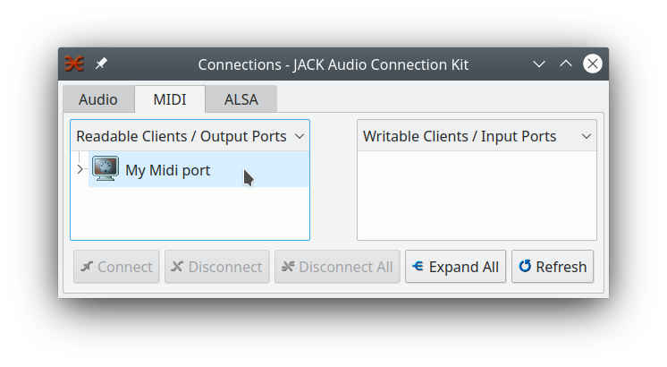
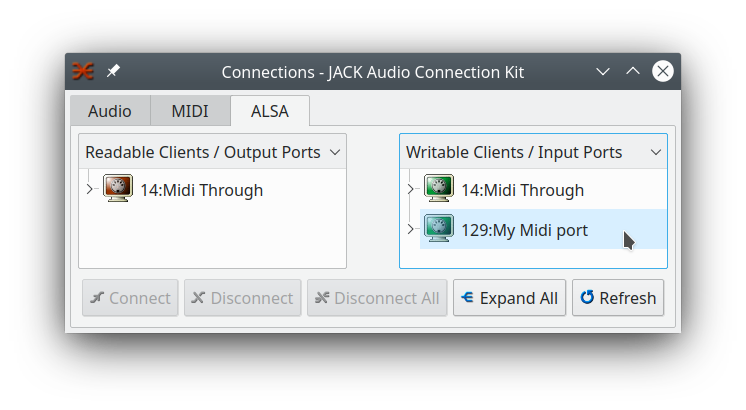
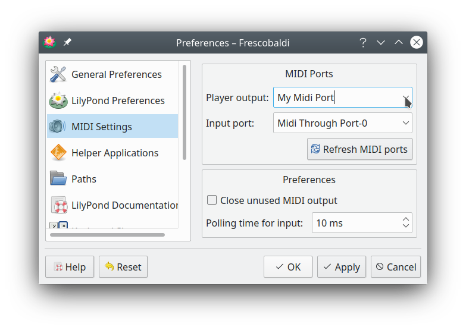
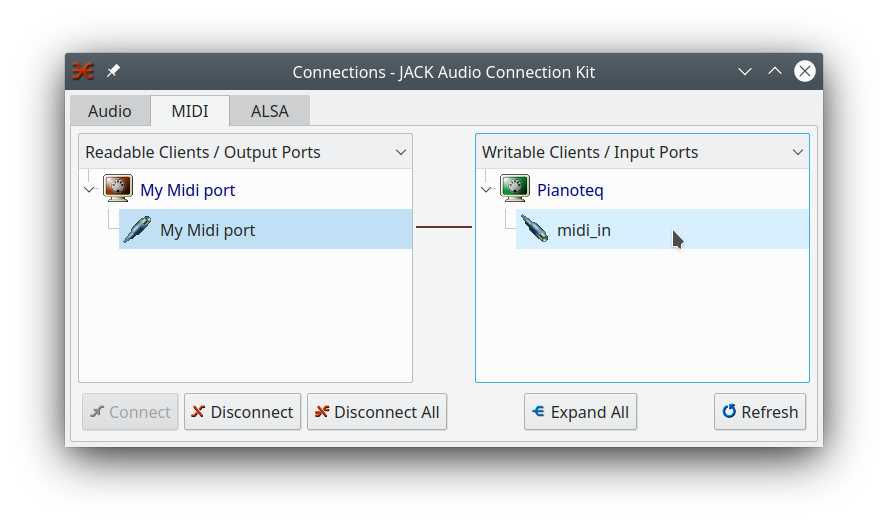
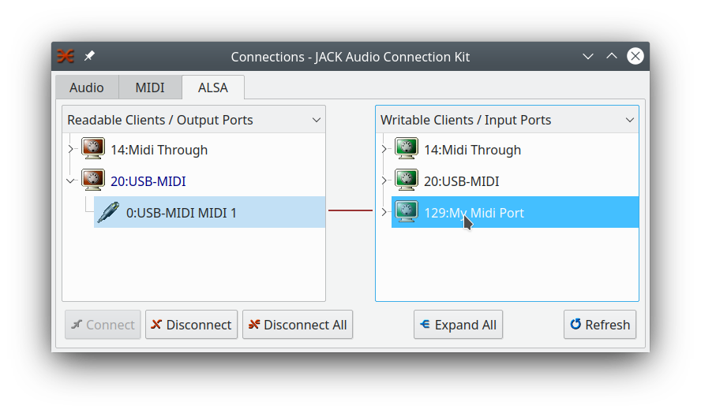
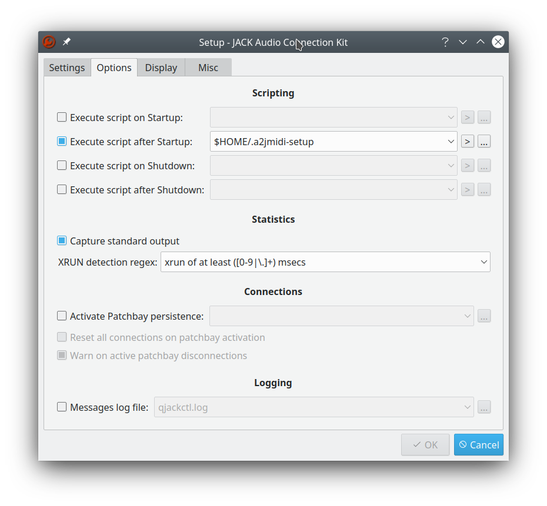
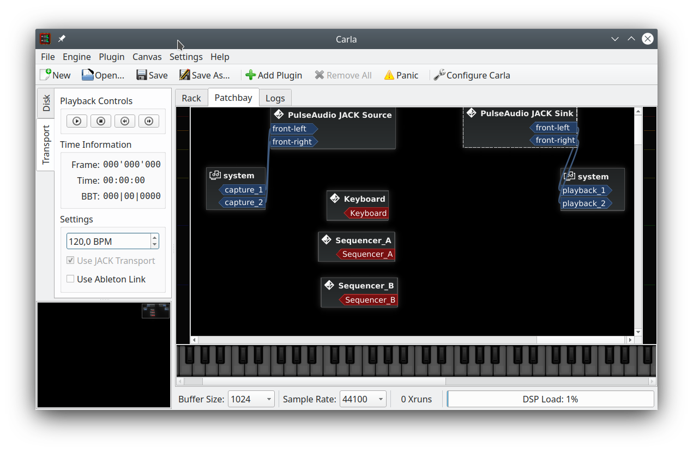

# a2jmidi

A one-way static bridge, connecting ALSA-MIDI to JACK-MIDI.

[_Advanced Linux Sound Architecture_ (ALSA)](https://alsa-project.org/) 
and
[_JACK Audio Connection Kit_ (JACK)](https://jackaudio.org/)
are both software frameworks used in LINUX for audio/MIDI applications.

The __a2jmidi__-utility provides a stable, time-accurate _bridge_ connecting
JACK-based applications
to MIDI Hardware or to ALSA-MIDI-based software. 

Incoming MIDI events will be detected within less than a millisecond 
and will be aligned into the JACK-buffer 
with sample precision. 

## Usage
To create a new bridge, open a terminal-window and do:

```console
$ a2jmidi  [options] [name]
```
Where `name` is a user chosen name for the bridge.
The given name will be used to label the _client_ and also the _port_. If there is already a
_client_ with the given name, the bridges name will be made unique by appending a number.
A name containing spaces must be enclosed into quotation marks.

Allowed options are:

- __`-h [ --help ]`__ display help and exit
- __`-v [ --version ]`__ display version information and exit
- __`-s [ --startjack ]`__ try to start the JACK server if not already running
- __`-c [ --connect ] source-identifier`__ identifies a source of ALSA-MIDI events (such as a sequencer-port
  or a MIDI device) for monitoring. The source will be connected as soon as it becomes available.
- __`-n [ --name ] (optional) name`__ same as the _name_ argument above. 
  
The `source-identifier` can be specified as the combination of _client-number_ and _port-number_
such as `28:0` or the label of a port such as `"USB-MIDI MIDI 1"`.

To stop the bridge, shutdown the JACK server or do `ctrl-c`.

## Example 1 
Start the JACK-server with [QjackCtl](https://qjackctl.sourceforge.io/),
then open a terminal and do: 

```console
$ a2jmidi "My Midi port"
```
In the MIDI-window of _QjackCtl_ we will see a new JACK-Midi client called `My Midi port`.
This is the __JACK side__ of the bridge.

   
 
The following screenshot shows the connections of ALSA-MIDI sequencer.
We see, there is a new ALSA-Midi-client called `My Midi port`, this is the 
__ALSA side__ of the bridge.
 
- Note: the panel labeled "ALSA" appears in the connections-window 
of _QjackCtl_, only when we have 
activated the _ALSA Sequencer support_ in the _Misc_ Tab of the _QjackCtl_-Setup.



The ALSA- and the JACK- ports remain available as long as the  JACK server 
runs. Even after a short break of system-hibernation the bridge should restart
to work normally.

We have now a permanent ALSA to JACK bridge which
can be connected by applications that produce ALSA-MIDI events. Like
for example [Frescobaldi](https://www.frescobaldi.org/). Frescobaldi is a 
tool to create professional looking sheet music. The music composition can be proof-read 
(proof-listened?) by listened the generated MIDI.
Below, we see how to connect Frescobaldi's midi output to 
our `My Midi port` created above.



Finally, the JACK side port can be connected to a virtual MIDI synthesizer as in the example below:



Now, we can hear our music compositions played on the virtual piano.

## Example 2 - Connecting USB Hardware

USB Midi hardware can be plugged on and off while the JACK server is running. 
__a2jmidi__ permits to setup connections to such USB Midi hardware independently
whether the hardware is connected or not.
 
__a2jmidi__ will watch the state of connections and automatically grasp a specific 
port as soon as it becomes available. To this end we need to know the port name 
under which the USB Hardware is known to ALSA. To find out, we can use
the command `aconnect -i` as in the example below:
```console
$ aconnect -i
client 0: 'System' [type=kernel]
    0 'Timer           '
    1 'Announce        '
client 14: 'Midi Through' [type=kernel]
    0 'Midi Through Port-0'
client 28: 'USB-MIDI' [type=kernel]
    0 'USB-MIDI MIDI 1 '
```
In this example we see, there is a device that
reports its MIDI output as _"USB-MIDI MIDI 1"_. 
This device is an USB piano keyboard that we want to 
include into our JACK Audio setup.

In order to have __a2jmidi__ to automatically 
connect to this device, we'll start it with the following command:
```console
$ a2jmidi "My Midi port" --connect "USB-MIDI MIDI 1"
```
In the screenshot below we see that the bridge called "My Midi port" 
is now connected to the "USB-MIDI MIDI 1" device.


When the USB device is powered off, the bridge will stay alive. As soon as 
a MIDI device called "USB-MIDI MIDI 1" reappears, the bridge will reconnect to it.

Now we are able to set up complex audio-midi patches including our
USB piano keyboard, even 
before the keyboard is connected or is powered on.

# Example 3

In this example we will merge example 1 and example 2 into one
startup script.   

Create a file with the following content:
```shell script
#!/usr/bin/env bash

a2jmidi --name "Keyboard" --connect "USB-MIDI MIDI 1" & 
sleep 1
a2jmidi "Sequencer_A" & 
sleep 1 
a2jmidi "Sequencer_B" &  

```
Save this file as `.a2jmidi_setup` under your root and make it executable.

In _QjackCtl_ go to the Setup/Options panel. Activate `Execute Script after Startup`
and enter `$HOME/.a2jmidi_setup` as startup script.


When we start the
[Carla-audio-plugin-host](https://github.com/falkTX/Carla)
we now see three midi plugs (the red ones) labeled "Keyboard", "Sequencer_A", "Sequencer_B".



The port labeled "Keyboard" will deliver the MIDI events from the keyboard.
The ports  "Sequencer_A" and "Sequencer_B" can be used to connect ALSA-based software as in example 1.

## Build and Install

Instructions on how to build and install can be found
in the document [INSTALL.md](INSTALL.md).

## Similar Tools

### Package a2jmidid

In the official Ubuntu repositories 
there is the [a2jmidid](https://packages.ubuntu.com/groovy/a2jmidid) package.

This package contains an executable called `a2jmidi_bridge` which has very 
similar functionality to
the utility presented here. 
Unfortunately, the timing accuracy is not perfect. `a2jmidi_bridge` aligns 
all MIDI events at the beginning 
of each JACK-buffer. Especially with larger buffers, this might result in very inaccurate 
rhythms. 

In the same package there is also an executable called `a2jmidid` which
has much better timing accuracy. Like our tool it discovers newly connected ALSA hardware
and provides an ALSA to JACK bridge, by mirroring the ALSA-side ports to JACK-side ports.
But unlike __a2jmidi__, you cannot with `a2jmidid` establish the JACK-side connections 
unless the ALSA-side Hardware- or Software- ports are alive. 

With the __a2jmidi__-utility, on the other hand, JACK-side and ALSA-side applications 
can be started independently and in any sequence.

